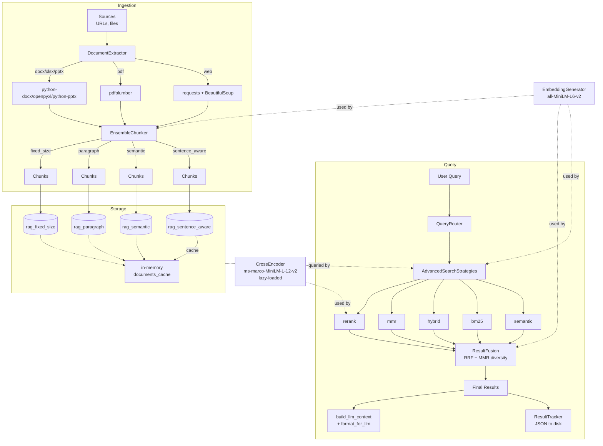
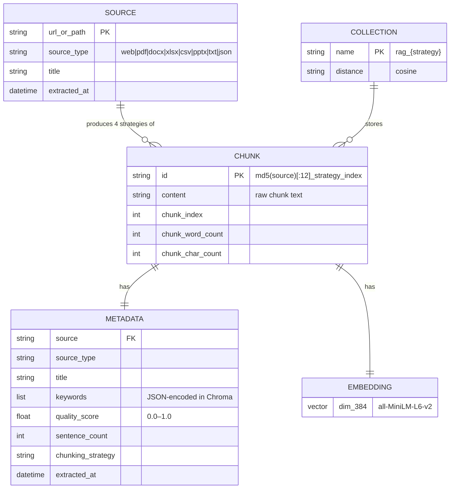
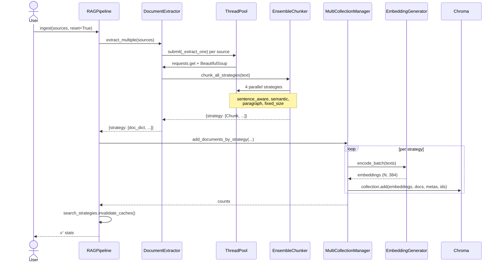
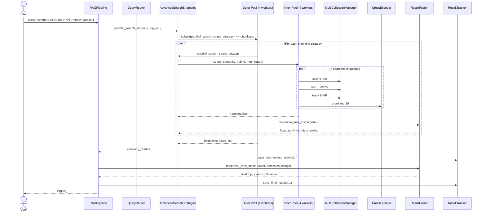
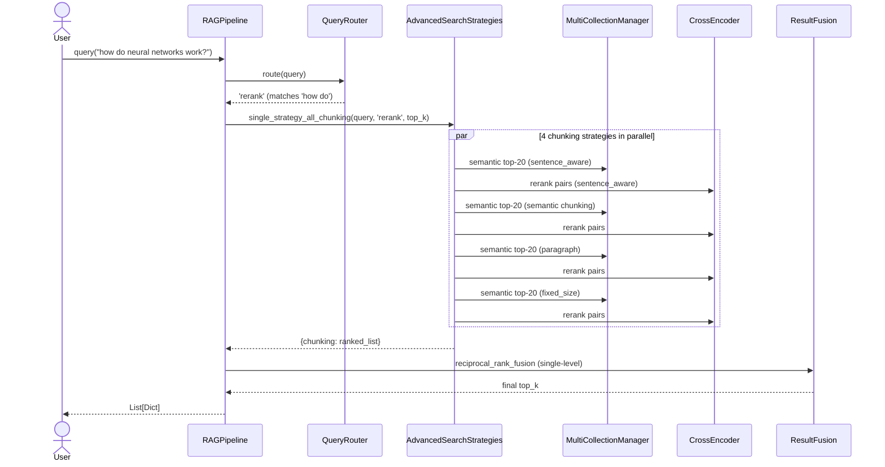

# PROJECT_DOCUMENTATION.md

> Internship deliverable. Written so the author can re-read this file the night before the demo and walk in cold to defend every line. All references are to actual code in this repository.

---

## 1. Executive Summary

This project is an **Advanced Retrieval-Augmented Generation (RAG) system** — a backend that ingests heterogeneous documents (web pages, PDFs, Word, Excel, PowerPoint, CSV, JSON, plain text), chunks them four different ways simultaneously, indexes each variant in its own vector collection, and answers natural-language queries by running up to **16 retrieval searches in parallel** and fusing the results into a single ranked list with full provenance.

**Who it serves and how it changes the workflow.** The system is an internship deliverable built for the internal R&D team — a self-contained retrieval pipeline for evaluating chunking and retrieval approaches against private corpora (internal documentation, research collateral, mixed-format knowledge bases) as the foundation for future LLM-backed assistants. Before this existed, comparing retrieval approaches against a corpus required hand-rolling separate prototypes per chunking method and per retriever and squinting at unranked outputs side-by-side; the team would commit to a single chunking + retriever pair early and inherit its failure modes for the rest of the project. This system replaces that ad-hoc workflow with a single pipeline that runs every reasonable approach concurrently and persists every intermediate result to disk for later replay and audit. The deliverable is a research prototype today; the architecture is intentionally library-shaped so the same engine can be wrapped behind a service when a downstream product picks it up.

**The problem it solves.** A single chunking method or a single retriever (pure semantic, pure keyword, etc.) consistently fails on some class of query — short keyword queries collapse on pure semantic search, conceptual queries collapse on BM25, long-form documents lose context with fixed chunk sizes. This project is an empirical answer to that fragility: it runs every reasonable approach in parallel and lets [Reciprocal Rank Fusion](strategies/fusion.py) decide which results most strategies agreed on.

**What it produces.** Application developers receive structured chunks tagged with `final_score`, `confidence`, `strategies_used`, and `strategy_ranks` so the downstream LLM (or a human reviewer) can see *which* retrievers found *which* chunks at *which* rank — full provenance, not a black box. The pipeline also formats those chunks into an LLM-ready prompt with token budgeting ([pipeline.py:215-292](pipeline.py#L215-L292)).

**Impact.** Where most production RAG stacks pick one chunking + one retriever and accept the failure modes, this system trades extra CPU at ingestion + query time for higher recall and a measurable confidence signal on every result — and persists the full per-strategy decision trail so retrieval quality can be debugged after the fact rather than guessed at.

---

## 2. Tech Stack & Rationale

| Layer | Choice | File | Why this over alternatives |
|---|---|---|---|
| Language | Python 3.8+ | [requirements.txt](requirements.txt) | Required by the ML/NLP ecosystem (sentence-transformers, chromadb). |
| Embedding model | `all-MiniLM-L6-v2` | [config/settings.py:32](config/settings.py#L32) | 384-dim, ~80MB, CPU-friendly — chosen so the pipeline can ingest and query end-to-end on any laptop without GPU dependencies or external API keys. The model interface is fully swappable via `EmbeddingConfig` ([config/settings.py:31-36](config/settings.py#L31-L36)); a next iteration can move to `all-mpnet-base-v2` or a hosted embedding for higher recall when GPU/budget is available. |
| Cross-encoder (rerank) | `cross-encoder/ms-marco-MiniLM-L-12-v2` | [config/settings.py:58](config/settings.py#L58) | Trained on MS-MARCO passage ranking; the de-facto baseline cross-encoder. Loaded **lazily** ([search_strategies.py:60-65](strategies/search_strategies.py#L60-L65)) so the ~120MB model is paid for only when rerank actually runs — first-time queries are fast and rerank cost is amortized across the process. |
| Vector DB | ChromaDB (PersistentClient) | [core/database.py:48](core/database.py#L48) | Embeds in-process, no external server, persists to disk. Trade-off: not horizontally scalable like Pinecone/Weaviate/Qdrant — but right for a single-machine internship build. Cosine space configured at collection creation ([database.py:55-58](core/database.py#L55-L58)). |
| Lexical retrieval | `rank-bm25` (BM25Okapi) | [search_strategies.py:16](strategies/search_strategies.py#L16) | Pure-Python, no Java dep (Elasticsearch). Built per-strategy and cached by content fingerprint ([search_strategies.py:67-85](strategies/search_strategies.py#L67-L85)) so we don't rebuild on every query. |
| Web extraction | `requests` + `BeautifulSoup` | [extraction.py:18-19](core/extraction.py#L18-L19) | Standard, well-understood; nav/footer/script tags stripped before chunking ([extraction.py:153-154](core/extraction.py#L153-L154)) so boilerplate doesn't dominate results. |
| PDF | `pdfplumber` | [extraction.py:211-219](core/extraction.py#L211-L219) | The actual code uses `pdfplumber` (lazy-imported). The README mentions PyPDF2 — that's a doc inconsistency in the README; PyPDF2 is **not** in `requirements.txt` and **not** imported anywhere in the code. |
| DOCX / XLSX / PPTX | `python-docx`, `pandas`+`openpyxl`, `python-pptx` | [extraction.py:221-228, 230-251, 266-282](core/extraction.py#L221-L228) | All lazy-imported in their respective `_extract_*` methods. Format-native libraries. |
| Numerics | NumPy, scikit-learn (cosine_similarity) | [search_strategies.py:15-18](strategies/search_strategies.py#L15-L18) | NumPy for percentile normalization ([scorer.py:85-110](scoring/scorer.py#L85-L110)) and MMR cosines; sklearn used only for `cosine_similarity` in MMR ([search_strategies.py:274](strategies/search_strategies.py#L274)). |
| Concurrency | `concurrent.futures.ThreadPoolExecutor` | many files | Workloads here are I/O- and CPU-but-numpy-heavy; numpy releases the GIL so threads work. Process pools would have crippling startup cost for short tasks. |

No web framework, no database other than Chroma, no message broker. This is a **library / pipeline**, not a service.

---

## 3. System Architecture



**Key architectural facts**

- **One ChromaDB collection per chunking strategy** — `rag_sentence_aware`, `rag_semantic`, `rag_paragraph`, `rag_fixed_size` — set up at [database.py:43-45](core/database.py#L43-L45). This isolates each chunker's embedding space and lets fusion combine *different views* of the same source.
- **In-memory `documents_cache`** ([database.py:41](core/database.py#L41)) mirrors each collection — required because BM25 needs raw tokenized text on every query and going back to Chroma per query would be expensive.
- **Two-level RRF fusion** in parallel mode (see §10).
- **No web server.** This is a Python library imported and called.

---

## 4. Project Structure

```
rag_system/
├── pipeline.py                      Top-level orchestrator (RAGPipeline class)
├── example_usage.py                 Minimal end-to-end demo
├── requirements.txt                 Pinned dep ranges
├── README.md                        User-facing documentation
├── config/
│   ├── settings.py                  Five config classes + module-level singletons
│   └── __init__.py                  Empty
├── core/
│   ├── extraction.py                DocumentExtractor — multi-format parsing + chunk dispatch
│   ├── chunking.py                  EnsembleChunker, ChunkQualityScorer, AdaptiveKeywordExtractor
│   ├── embedding.py                 EmbeddingGenerator — sentence-transformers wrapper
│   └── database.py                  MultiCollectionManager — one Chroma collection per chunker
├── strategies/
│   ├── search_strategies.py         AdvancedSearchStrategies — 5 primitives + 3 orchestrators
│   ├── fusion.py                    ResultFusion — RRF + MMR diversification
│   ├── query_router.py              QueryRouter — heuristic query classifier
│   └── result_tracker.py            ResultTracker — persists intermediate + final results
├── scoring/
│   └── scorer.py                    UnifiedScorer — percentile normalization + metadata boost
├── utils/
│   └── helpers.py                   Sentence splitter, Jaccard similarity, token estimator
└── data/                            (auto-created at runtime — gitignored)
    ├── chroma_db/                   Persistent Chroma store
    ├── extracted/                   JSON-serialized chunks (one file per source × strategy)
    ├── search_results/
    │   ├── intermediate/            Per-chunking-strategy results before fusion
    │   └── final/                   Top-N fused results
    └── models/                      sentence-transformers download cache
```

**Why this layout**

- `core/` = "what the data IS" (extraction, chunks, embeddings, storage).
- `strategies/` = "how we look stuff up" (retrieval, fusion, routing, persistence of query results).
- `scoring/` = single-purpose scoring math separated from any retriever, so all strategies share normalization.
- `config/` is a module of plain classes used as singletons ([settings.py:1-6](config/settings.py#L1-L6)) — chosen over `dataclass` deliberately so attributes are class-level globals, not instance fields.

---

## 5. Data Model

There is **no relational database**. Persistent state lives in:

1. **ChromaDB collections** (vector store)
2. **JSON files on disk** (extracted chunks + saved query results)
3. **In-memory caches** (BM25 index, documents_cache)

### Entities



### Important constraints / defaults

| Field / setting | Where | Value | Note |
|---|---|---|---|
| Chunk ID format | [extraction.py:304](core/extraction.py#L304) | `{md5(source)[:12]}_{strategy}_{index}` | Deterministic — same source + strategy + index always produces same id. Powers the `update_mode='skip'` idempotency. |
| Chunking target | [settings.py:24](config/settings.py#L24) | 300 words | Overlap 50 words ([settings.py:25](config/settings.py#L25)). |
| Chunk min/max | [settings.py:26-27](config/settings.py#L26-L27) | 30 / 500 words | Below min: dropped. Above max: enforced for the semantic strategy via `_SEMANTIC_MAX_SENTENCES = 5` at [chunking.py:25](core/chunking.py#L25); the other strategies treat `max_chunk_words` as a soft target — a future iteration will add hard truncation across all four. |
| Embedding dim | model | 384 | All chunks share this dimensionality — this is what enables cross-collection MMR diversification. |
| Chroma distance | [database.py:57](core/database.py#L57) | `hnsw:space=cosine` | Distance returned by Chroma is cosine distance; converted to similarity by `1 - d/2` ([database.py:293](core/database.py#L293), [scorer.py:18-20](scoring/scorer.py#L18-L20)). |
| Metadata coercion | [database.py:166-181](core/database.py#L166-L181) | Lists/dicts → JSON strings | Chroma only stores scalars; `keywords` and `strategies_used` round-trip through JSON ([database.py:24](core/database.py#L24)). |
| Insert batch size | [settings.py:42](config/settings.py#L42) | 100 | Chroma `add()` is batched in [database.py:157-164](core/database.py#L157-L164). |

### `update_mode` behaviors ([database.py:65-114](core/database.py#L65-L114))

- `skip` (default): drop docs whose IDs already exist. Idempotent re-ingest.
- `replace`: delete the IDs first, evict from cache, insert fresh.
- `merge`: skip docs whose **content hash** is already present in any cached doc — different from `skip`, which is ID-based. Useful when two sources share text.

---

## 6. Core Features & Functionality

### 6.1 Multi-format ingestion ([core/extraction.py](core/extraction.py))

- **What it does**: takes a list of URLs and/or file paths and produces strategy-keyed chunk lists ready for the DB layer.
- **Flow**: `RAGPipeline.ingest()` → `DocumentExtractor.extract_multiple()` → `ThreadPoolExecutor` dispatches each source → `_extract_one()` routes to web vs file → format-specific extractor returns raw text → `_chunk_with_all_strategies()` invokes `EnsembleChunker.chunk_all_strategies()` → returns `{strategy: [chunk_dict, ...]}`.
- **Code path**: [pipeline.py:59-88](pipeline.py#L59-L88) → [extraction.py:43-74](core/extraction.py#L43-L74) → [extraction.py:140-196](core/extraction.py#L140-L196) → [chunking.py:219-256](core/chunking.py#L219-L256).
- **Edge cases handled**:
  - Web pages with <100 chars after stripping nav: raises `ValueError` ([extraction.py:160-163](core/extraction.py#L160-L163)).
  - Unsupported extension: raises `ValueError` ([extraction.py:182-183](core/extraction.py#L182-L183)).
  - Per-source failures isolated: `try/except` per future ([extraction.py:65-66](core/extraction.py#L65-L66)) — one bad source doesn't kill ingestion.
  - Filenames are sanitized via `_safe_basename` ([extraction.py:341-352](core/extraction.py#L341-L352)) — URL paths and stems are alphanum-or-`._-` only.

### 6.2 Ensemble chunking ([core/chunking.py](core/chunking.py))

Four strategies run in parallel for every document:

1. **`_sentence_aware_chunk`** ([chunking.py:275-302](core/chunking.py#L275-L302)) — accumulate sentences until adding the next would exceed `target_words`; flush, carry an overlap tail of the previous chunk into the next. Uses `_tail_within_word_budget` ([chunking.py:394-408](core/chunking.py#L394-L408)) to choose the overlap so it ends at a sentence boundary.
2. **`_semantic_chunk`** ([chunking.py:304-333](core/chunking.py#L304-L333)) — Jaccard similarity between consecutive sentences; split when similarity drops below `similarity_threshold` (0.3), or 5-sentence cap, or word target reached.
3. **`_paragraph_chunk`** ([chunking.py:335-357](core/chunking.py#L335-L357)) — accumulate `\n\n`-separated paragraphs to target word count.
4. **`_fixed_size_chunk`** ([chunking.py:359-377](core/chunking.py#L359-L377)) — sliding-window fixed-size with overlap. The `step = max(target - overlap, 1)` guards against an infinite loop on bad config.

Each chunk gets, automatically:
- `keywords` — top-5 from `AdaptiveKeywordExtractor` ([chunking.py:37-76](core/chunking.py#L37-L76)), single-doc TF-IDF on words ≥4 chars, with stopwords filtered. **Deliberate design choice**: TF-IDF against the document itself — we don't have a corpus at chunking time, and we want keywords *characterizing this chunk*, not separating it from a corpus we don't have.
- `quality_score` — 0–1 score from `ChunkQualityScorer` ([chunking.py:79-201](core/chunking.py#L79-L201)) blending length z-score, keyword density, sentence-length consistency, and information content (unique-word ratio + numeric/entity density). **Boilerplate detector** ([chunking.py:191-201](core/chunking.py#L191-L201)) returns 0 outright for navigation/footer text.

### 6.3 Multi-collection storage ([core/database.py](core/database.py))

- One Chroma collection per chunking strategy, cosine space.
- Idempotent ingest via `update_mode` (see §5).
- Documents kept in-memory in `documents_cache` because BM25 needs raw text.
- `add_documents_by_strategy` ([database.py:65-114](core/database.py#L65-L114)) batches embedding then `collection.add()` in size-100 chunks.

### 6.4 Five search primitives ([strategies/search_strategies.py](strategies/search_strategies.py))

All take `(query, chunking_strategy, n_results)` and return a list of result dicts.

| Primitive | What it does | Code |
|---|---|---|
| `semantic_search` | Pure cosine over embeddings; over-fetch 2×N for diversity slack. | [L106-121](strategies/search_strategies.py#L106-L121) |
| `bm25_search` | Tokenized BM25Okapi; cached index, percentile-normalized scores. | [L123-160](strategies/search_strategies.py#L123-L160) |
| `hybrid_search` | `α·vector + (1-α)·BM25`, α=0.7 default. | [L162-223](strategies/search_strategies.py#L162-L223) |
| `mmr_search` | Maximal Marginal Relevance for relevance + diversity, λ=0.7. | [L225-291](strategies/search_strategies.py#L225-L291) |
| `rerank_search` | Cross-encoder rerank over a 20-candidate pool. | [L293-325](strategies/search_strategies.py#L293-L325) |

Each primitive ends with `_diversify_results` ([L413-447](strategies/search_strategies.py#L413-L447)) — Jaccard-based duplicate filter at threshold 0.85.

### 6.5 Three orchestrators

- `parallel_search_single_strategy(query, chunking_strategy)` — runs **4 search primitives in parallel** (semantic + hybrid + mmr + rerank — **BM25 is intentionally excluded** because hybrid already incorporates BM25 signal) against ONE chunking strategy, then inner-fuses with RRF. ([L329-350](strategies/search_strategies.py#L329-L350))
- `parallel_search_all(query)` — fans out across all 4 chunking strategies, calling the above for each. **= 16 searches** (4 chunking × 4 search). Outer fusion happens later in `pipeline.query`. ([L352-364](strategies/search_strategies.py#L352-L364))
- `single_strategy_all_chunking(query, search_strategy)` — runs one named search primitive against every chunking strategy. **= 4 searches** (one search × 4 chunkings). Used by every non-`parallel` mode. ([L366-388](strategies/search_strategies.py#L366-L388))

### 6.6 Reciprocal Rank Fusion + diversity ([strategies/fusion.py](strategies/fusion.py))

- `RRF score = Σ 1/(k + rank)` with k=60 (Cormack et al. 2009).
- Confidence = `0.40·coverage + 0.30·quality + 0.30·agreement` ([fusion.py:119-146](strategies/fusion.py#L119-L146)).
- Final pass: MMR diversification ([fusion.py:148-186](strategies/fusion.py#L148-L186)) over already-RRF-ranked results to drop near-duplicates.

### 6.7 Query routing ([strategies/query_router.py](strategies/query_router.py))

Classifies the query by surface form and maps to a search mode:

| Classification | Mode | Why |
|---|---|---|
| Starts with `how to/do/can/does` | `rerank` | Cross-encoder shines on intent-matching. |
| `what is`, `define`, `explain` | `semantic` | Conceptual similarity is the right signal. |
| Contains `compare`, `vs`, `difference` | `parallel` | Multiple perspectives improve recall. |
| `list`, `enumerate` | `mmr` | Diversity is the goal. |
| ≤3 words | `hybrid` | Short queries: mix BM25 (lexical) + vector. |
| else | `parallel` | When intent is unclear, use everything. |

### 6.8 Result persistence ([strategies/result_tracker.py](strategies/result_tracker.py))

Every query saves two JSONs:
- `data/search_results/intermediate/` — per-chunking-strategy results before fusion.
- `data/search_results/final/` — top-N fused results.

Filenames embed mode, query slug, timestamp, and an atomic counter ([result_tracker.py:118-120](strategies/result_tracker.py#L118-L120)) so concurrent batched queries can't collide on the same wall-clock second.

### 6.9 LLM context building ([pipeline.py:215-292](pipeline.py#L215-L292))

Packs ranked chunks into a prompt that fits a token budget (default 4000), greedy-fill: stops the moment the next chunk would overshoot. Approximation: 4 chars/token. Each chunk gets a header showing confidence, chunking strategy, search strategy, and source.

---

## 7. Request / Data Flow

### 7.1 Ingestion: `pipeline.ingest(["https://en.wikipedia.org/wiki/Machine_learning"])`



Single key insight: the `invalidate_caches()` call at [pipeline.py:84](pipeline.py#L84) is what guarantees BM25 indexes get rebuilt against the freshly-augmented corpus on the next query.

### 7.2 Query (parallel mode): `pipeline.query("compare CNN and RNN", mode='parallel')`



The two-level RRF is the architectural hot spot worth pointing at in a demo:
- **Inner RRF** ([search_strategies.py:347](strategies/search_strategies.py#L347)) — fuses 4 search strategies' results within one chunking.
- **Outer RRF** ([pipeline.py:159-161](pipeline.py#L159-L161)) — fuses 4 chunking-strategy result lists into the final top-K.

### 7.3 Query (auto-route mode): `pipeline.query("how do neural networks work?")`



---

## 8. API Reference

This is a **Python library**, not an HTTP service — there are no REST endpoints. The "API" is the `RAGPipeline` class.

| Method | Signature | What it does | File:line |
|---|---|---|---|
| `__init__` | `(verbose: bool = True)` | Wires up extractor, DB manager, search, fusion, tracker; calls `db_manager.initialize()` (creates 4 collections, refreshes caches). | [pipeline.py:47-55](pipeline.py#L47-L55) |
| `ingest` | `(sources, reset=False, save_extracted=True, update_mode='skip')` | Extract → chunk × 4 strategies → embed → write to 4 collections. Invalidates BM25 cache. | [pipeline.py:59-88](pipeline.py#L59-L88) |
| `load_from_json` | `(folder_path, reset=False, update_mode='skip')` | Re-index previously-extracted JSON without re-extracting. | [pipeline.py:90-111](pipeline.py#L90-L111) |
| `query` | `(query_text, top_k=5, mode=None, auto_route=True, min_confidence=0.0, save_results=True)` | Run search + fusion. `mode=None` + `auto_route=True` → router picks. `mode='parallel'` → 16 searches. Else → 4 searches with named primitive. | [pipeline.py:115-178](pipeline.py#L115-L178) |
| `query_batch` | `(queries, top_k=5, mode=None, auto_route=True, max_workers=4, save_results=True)` | Multiple queries in parallel; per-query timeout 120 s ([pipeline.py:42](pipeline.py#L42)); per-query failures isolated. | [pipeline.py:180-211](pipeline.py#L180-L211) |
| `build_llm_context` | `(results, max_tokens=4000, include_metadata=True, min_confidence=0.0)` | Greedy-fill chunks under a char budget (4 chars/token). Returns dict with `context`, `chunks_used`, `estimated_tokens`, `sources`, `avg_confidence`. | [pipeline.py:215-274](pipeline.py#L215-L274) |
| `format_for_llm` | `(query, context_dict, system_prompt=None)` | Returns final prompt string ready for an LLM call. | [pipeline.py:276-292](pipeline.py#L276-L292) |
| `clear_database` | `()` | Deletes every Chroma collection, re-initializes empty ones, invalidates caches. | [pipeline.py:296-300](pipeline.py#L296-L300) |
| `get_stats` | `()` | Returns `{strategy: {count, cached}, total: int}`. | [pipeline.py:302-303](pipeline.py#L302-L303) |

### Result schema (returned by `query`)

```python
{
    "id": "abc123_sentence_aware_4",
    "content": "...",
    "metadata": {
        "source": "https://...",
        "title": "...",
        "keywords": [...],
        "quality_score": 0.78,
        "chunking_strategy": "sentence_aware",
        ...
    },
    "similarity_score": 0.82,            # only present for results that came through Chroma's vector path (semantic, hybrid, mmr, rerank). BM25-only results have `bm25_score` instead.
    "chunking_strategy": "sentence_aware",
    "search_strategy": "rerank",         # which primitive picked it first; survives fusion via "first-occurrence wins" because fusion.py:55 only sets result_data once.
    "fusion_score": 0.034,               # raw RRF score
    "final_score": 0.91,                 # RRF / max_possible_RRF, clamped [0,1]
    "confidence": 0.74,                  # see fusion.py:119-146
    "strategies_used": ["sentence_aware", "semantic"],   # outer-fusion provenance
    "strategy_ranks": {"sentence_aware": 1, "semantic": 3},
    "strategy_scores": {...},
}
```

### Error cases

- `ingest` with no extractable content → returns silently with `⚠️ No documents extracted` ([pipeline.py:71-73](pipeline.py#L71-L73)).
- `add_documents_by_strategy` with bad `update_mode` → `ValueError` ([database.py:80-81](core/database.py#L80-L81)).
- Extracting an unsupported file extension → `ValueError("Unsupported file type: ...")` ([extraction.py:182-183](core/extraction.py#L182-L183)).
- A search strategy raises during fan-out → logged, returns empty list, other strategies continue ([search_strategies.py:407-410](strategies/search_strategies.py#L407-L410)).
- `query_batch` per-query exception → caught, query gets empty list ([pipeline.py:206-208](pipeline.py#L206-L208)).

---

## 9. Authentication & Authorization

**Not implemented in repo.** The system is a library with no user model, no API surface, no token validation, no RBAC. Anyone with file-system access to `data/chroma_db/` can read every embedding.

The project scope was retrieval quality, and the architecture is deliberately library-shaped: when this is deployed behind an HTTP service, authentication, rate limiting, and tenant isolation belong at that boundary (e.g., FastAPI middleware, an API gateway). Keeping those concerns out of the retrieval engine is the right separation — it lets the retrieval logic remain reusable across deployment shapes (CLI, batch job, internal service) without rewriting auth.

The only "trust boundary" present is the web extractor's `User-Agent` header ([settings.py:18](config/settings.py#L18)) and a 30-second request timeout ([settings.py:16](config/settings.py#L16)) — defensive, not security.

---

## 10. Key Algorithms / Business Logic

### 10.1 Reciprocal Rank Fusion (RRF) — [strategies/fusion.py:29-79](strategies/fusion.py#L29-L79)

Given ranked lists from N strategies, score each unique document:
```
RRF(doc) = Σᵢ 1 / (k + rank_i(doc))     where k = 60
```
- **Why k=60**: from the original Cormack-Clarke-Buettcher 2009 paper. It flattens contributions from low-ranked documents — a doc at rank 1 contributes `1/61 ≈ 0.0164`, at rank 10 contributes `1/70 ≈ 0.0143`, at rank 50 contributes `1/110 ≈ 0.0091`, so ranks 1–10 still meaningfully dominate but late ranks aren't ignored.
- **Why RRF over score-weighted fusion**: scores from BM25, cosine, and a cross-encoder are on **different distributions**; combining them by raw score requires per-strategy calibration we don't have. RRF only uses ranks, which are directly comparable.
- **Final score normalization** ([fusion.py:71-72](strategies/fusion.py#L71-L72)): `min(rrf / max_possible, 1.0)` where `max_possible = N / (k+1)` (every strategy ranks the doc #1). This puts the visible `final_score` in [0,1].

### 10.2 Two-level fusion in parallel mode

```
Top-K
  ↑ outer RRF over chunking-strategy result lists  (pipeline.py:159)
  ├── sentence_aware fused list      ← inner RRF over (semantic, hybrid, mmr, rerank)
  ├── semantic fused list            ← inner RRF over the same 4
  ├── paragraph fused list           ← inner RRF
  └── fixed_size fused list          ← inner RRF
```

This is the **single most important architectural decision** in the project. It means an answer that surfaces in *multiple chunking views* of the same source is ranked above one that only appears in a single view — robustness against any one chunker producing pathological boundaries.

### 10.3 Confidence scoring — [fusion.py:119-146](strategies/fusion.py#L119-L146)

```
confidence = 0.40 · coverage + 0.30 · quality + 0.30 · agreement
```
- **coverage** = fraction of strategies that ranked this doc.
- **quality** = `1 / (1 + avg_rank/10)` — `0.91` at avg-rank 1, `0.83` at rank 2, `0.67` at rank 5; decays smoothly. (Approaches but never reaches 1.0.)
- **agreement** = `1 / (1 + std_dev/5)` over the strategies' ranks. High when strategies agree on rank.

The single-strategy edge case ([fusion.py:140-143](strategies/fusion.py#L140-L143)) sets agreement=1.0 but is naturally penalized via low coverage — so a doc found by only 1 of 4 strategies maxes out at ~0.40 + 0.30·quality + 0.30·1.0.

### 10.4 Percentile-based score normalization — [scoring/scorer.py:85-110](scoring/scorer.py#L85-L110)

BM25 and cross-encoder scores have unbounded, distribution-dependent ranges. Linear `min/max` normalization makes the result depend on the worst score in the batch. We instead **rank → percentile → linear map to [low, high]**:
- BM25 → [0.2, 1.0]: floor of 0.2 because low-but-nonzero matches still merit a vote in fusion.
- Cross-encoder → [0.3, 1.0]: higher floor because rerank candidates were already top-K filtered.

When all scores are nearly identical (`std < 1e-10`), return a uniform mid-band value ([scorer.py:101-102](scoring/scorer.py#L101-L102)).

### 10.5 MMR (Maximal Marginal Relevance) — [search_strategies.py:225-291](strategies/search_strategies.py#L225-L291), [fusion.py:148-186](strategies/fusion.py#L148-L186)

Greedy iterative selection:
```
score(d) = λ · relevance(d) - (1-λ) · max(similarity(d, s) for s in selected)
```
- λ=0.7 keeps relevance dominant.
- The seed pick is always the most-relevant doc ([search_strategies.py:253](strategies/search_strategies.py#L253)) — the original MMR paper requires this.

Two MMR runs are possible: per-strategy in `mmr_search`, and post-fusion in `_apply_diversity`. Both use the same λ.

### 10.6 BM25 cache invalidation — [search_strategies.py:67-103](strategies/search_strategies.py#L67-L103)

We rebuild BM25 only when the underlying corpus changes. Fingerprint = `md5(count + "|" + joined_ids)`. **Why not full content hash**: O(N) per query, and IDs already change deterministically when content is replaced. Cheap and correct.

### 10.7 Diversity filter (Jaccard) — [search_strategies.py:413-447](strategies/search_strategies.py#L413-L447)

After every primitive's ranked list, drop a candidate if `|A∩B|/|A∪B| > 0.85` against any already-selected result. O(n²) but bounded by `n_results * 2`. Cheap; embedding-based dedup is reserved for fusion ([fusion.py:81-105](strategies/fusion.py#L81-L105)).

### 10.8 Sentence splitting with abbreviation preservation — [utils/helpers.py:33-45](utils/helpers.py#L33-L45)

Naïve regex splits "Dr. Smith said..." into two sentences. We replace the period in known abbreviations with a NUL-delimited placeholder (`\x00DOT\x00`) before splitting, then restore. NUL-delimited because a NUL byte cannot appear in source text — collision-free.

### 10.9 Quality scoring (per-chunk) — [chunking.py:79-201](core/chunking.py#L79-L201)

```
quality = 0.30·length + 0.25·keyword_density + 0.25·coherence + 0.20·information
```
- **length**: z-score against document mean — chunks too short or too long are penalized.
- **keyword_density**: tapered optimum (0.08 for <100 words, 0.05 for <300, 0.03 above).
- **coherence**: sentence-length consistency penalized by fragment ratio (sentences <5 words).
- **information**: unique-word ratio + numeric density + capitalized-entity density.
- Boilerplate (nav, footer, copyright, "skip to") is short-circuited to 0 ([chunking.py:191-201](core/chunking.py#L191-L201)).

### 10.10 Metadata boost — [scoring/scorer.py:36-72](scoring/scorer.py#L36-L72)

Capped at +0.15 over the base relevance score. Two contributors:
1. Quality percentile relative to the result pool (or absolute thresholds when no pool).
2. Query-vs-title and query-vs-keywords overlap boost.

The cap exists so signals never override the underlying ranker — it's a tiebreaker, not a replacement.

---

## 11. External Integrations

There are **no networked third-party services** at query time. Everything runs locally.

| Integration | Where | Purpose | Failure mode |
|---|---|---|---|
| HuggingFace Hub | first-run only | Downloads `all-MiniLM-L6-v2` and `cross-encoder/ms-marco-MiniLM-L-12-v2` to `data/models/` ([settings.py:36](config/settings.py#L36)). | First-run ImportError or network timeout — model load fails; subsequent runs use the cache. |
| `requests` to arbitrary URLs | [extraction.py:147](core/extraction.py#L147) | Web scraping during ingestion. | 30-s timeout, raises `HTTPError` on 4xx/5xx; per-source `try/except` ([extraction.py:65-66](core/extraction.py#L65-L66)) keeps batch alive. |
| ChromaDB (local) | [database.py:48](core/database.py#L48) | Persistent vector store on local disk under `data/chroma_db/`. | If folder is deleted out from under us, next `initialize()` creates a fresh empty store. |

**No credentials, API keys, or secrets** are needed by this system. Be specific in the demo: this is part of why the project is reproducible on any laptop.

---

## 12. Setup, Run, Build & Deploy

### From a fresh machine

```bash
git clone <repo-url>
cd rag_system

# Recommended: virtualenv
python -m venv .venv
.venv\Scripts\activate            # Windows
# source .venv/bin/activate       # Mac/Linux

pip install -r requirements.txt
```

`requirements.txt` is pinned with upper bounds on `torch` (<2.5.0) and `transformers` (<4.45.0) — those bounds matter; newer versions break sentence-transformers loading.

### No environment variables

There is no `.env`, no API keys to set. Defaults in [config/settings.py](config/settings.py) are everything.

### Database setup

There is no manual DB setup. On first call, [pipeline.py:51](pipeline.py#L51) → `MultiCollectionManager.initialize()` creates `data/chroma_db/` and the four collections. The model cache `data/models/` is populated on first SentenceTransformer load.

### Run

```bash
# End-to-end smoke test (ingests Wikipedia ML page, runs two queries)
python example_usage.py
```

Or in your own code:
```python
from pipeline import RAGPipeline

p = RAGPipeline()
p.ingest(["https://en.wikipedia.org/wiki/Machine_learning"], reset=True)
results = p.query("What is supervised learning?", top_k=5)
```

### Build

There is no build step. The project is plain Python, no compilation, no bundling, no transpilation.

### Deploy

The project ships as a Python library with a clean import surface (`from pipeline import RAGPipeline`) — no Dockerfile, docker-compose, CI config, or `setup.py` is included because none is needed to use the pipeline today. The natural production-ization path is straightforward and well-understood: wrap `RAGPipeline` in a FastAPI app, containerize with Chroma's persistent volume mounted, add Prometheus metrics on query latency and result counts, and put the auth/rate-limit policy at the API gateway. Each of those is a localized addition, not a rewrite of the retrieval engine.

---

## 13. Design Decisions & Trade-offs

| Decision | Trade-off | Why made |
|---|---|---|
| 4 chunking strategies × 4 search strategies = 16 parallel searches | Higher latency/CPU per query than a single-method baseline | Robustness — no single method dominates on every query class. RRF lets us combine without per-strategy calibration. |
| One Chroma collection per chunking strategy | 4× the storage, can't query "all chunkings at once" with a single Chroma call | Each chunking has its own embedding distribution; isolating them keeps ranks meaningful within a collection, then fusion handles cross-collection comparison. |
| In-memory `documents_cache` | Memory grows with corpus | BM25 needs raw tokens; refetching from Chroma per query is too slow. |
| Threads (not processes) | GIL means CPU-bound pure Python doesn't parallelize | Numpy and torch release the GIL; sentence-transformers and ChromaDB releases are I/O- and C-extension-bound. Threads avoid pickling cost. |
| Plain config classes (not dataclasses) | Mutating at runtime affects all consumers | Module-level singletons with class attributes give us "global config" semantics intentionally. ([settings.py:1-6](config/settings.py#L1-L6)) |
| Lazy cross-encoder load | First rerank query pays ~120MB load cost | Most queries don't use rerank; loading eagerly makes pipeline construction slow for everyone. Double-checked locking ([search_strategies.py:60-65](strategies/search_strategies.py#L60-L65)) keeps it thread-safe. |
| BM25 cache by id-fingerprint not content hash | Theoretically possible to miss a content-only update | Update modes that change content also change IDs in our scheme; full content hash is O(N) per query. Cheap+correct given our id format. |
| `update_mode` defaults to `skip` (idempotent) | Re-ingesting a modified doc silently no-ops | Right default for "ingest the same source twice" — much more common than "the source actually changed." `replace` and `merge` cover the other cases. |
| Greedy LLM context fill (chars, not tokens) | Overestimates / underestimates per actual tokenizer | We don't know the downstream LLM's tokenizer; 4 chars/token is the standard rough rule and we're explicit about the approximation. ([pipeline.py:38-39](pipeline.py#L38-L39)) |
| Two-level RRF in parallel mode | More expensive than a single-level fusion across all 16 raw lists | Inner RRF gives each chunking strategy a proper ranked list before they're compared — keeps "agreement within a chunker" and "agreement across chunkers" separable signals. |
| Boilerplate detector | Tiny risk of false positives on legit short content | Without it, navigation links dominate web-page chunks and tank result quality. ([chunking.py:191-201](core/chunking.py#L191-L201)) |
| Stripping non-ASCII in `clean_text` | Loses unicode for non-English documents | Helper exists but isn't actually called during chunking — extraction keeps unicode. Keep this in mind if a director asks about i18n. ([helpers.py:26-30](utils/helpers.py#L26-L30)) |

### Config cleanup (audit-pass deletions)

A code audit pulled the following dead config keys out of `settings.py` so what remains in the file is the live, in-effect configuration surface:

- `SEARCH.confidence_thresholds` and `SEARCH.default_confidence_threshold` — removed; confidence filtering is now exclusively governed by the per-call `min_confidence` parameter at [pipeline.py:163-167](pipeline.py#L163-L167) (default `0.0`, returns all results so the caller's policy decides).
- `SearchConfig.enable_reranking` — removed; reranking is selected by mode (`'rerank'` or via the auto-router), so a separate flag was redundant.
- `ChunkingConfig.method` and `ChunkingConfig.max_chunks_per_document` — removed; holdovers from a pre-ensemble single-strategy era. The current ensemble runs all four chunkers in parallel.

Two utility functions in [`utils/helpers.py`](utils/helpers.py) (`clean_text`, `estimate_tokens`) remain in place as a public utility surface for future callers. `SearchConfig.bm25_k1` / `bm25_b` are kept because they document the BM25 parameters the project relies on (the values match `rank-bm25` library defaults, so behavior is consistent and a future iteration that wires them through `BM25Okapi(..., k1=..., b=...)` is a one-line change).

### Things that look unusual and why

- **`for _stream in (sys.stdout, sys.stderr): reconfigure(...)`** at [pipeline.py:21-27](pipeline.py#L21-L27) — protects against `cp1252` Windows code pages that can't render the emoji status prints. `errors='replace'` over a hard switch so unexpected output degrades gracefully.
- **Atomic `_save_counter`** in result_tracker — concurrent batch queries hitting the same wall-clock second won't collide on filenames.
- **`max(std, 50.0)` floor** in chunk-stats ([chunking.py:271](core/chunking.py#L271)) — keeps z-score length scoring well-conditioned for very uniform documents (otherwise std→0 and z→∞).
- **`norms = np.where(norms == 0, 1e-10, norms)`** in batched cosine ([fusion.py:202](strategies/fusion.py#L202)) — divide-by-zero guard for zero-vector edge case.

---

## 14. Limitations & Future Work

| Limitation | Where it shows | What the next iteration would do |
|---|---|---|
| No HTTP API | n/a | Wrap `RAGPipeline` in FastAPI; expose `/ingest` and `/query`. Add API-key auth. |
| No streaming for huge documents | [extraction.py:217-219](core/extraction.py#L217-L219) loads full PDF into memory | Switch to per-page streaming chunking so a 1000-page PDF doesn't OOM. |
| No relevance evaluation harness | n/a | Add a labeled query set + nDCG / Recall@K / MRR metrics so any fusion-weight or λ change can be measured, not guessed. |
| No GPU support paths | [settings.py:35](config/settings.py#L35) hardcodes `device='cpu'` | Detect CUDA, batch larger on GPU. |
| Query understanding is heuristic | [query_router.py](strategies/query_router.py) prefix matching | Replace with a small classifier or LLM-based intent detector. |
| No multilingual support | Embedding model is English-only | Swap to `paraphrase-multilingual-MiniLM-L12-v2` or LaBSE. |
| Quality-score weights are hand-tuned | [chunking.py:115-120](core/chunking.py#L115-L120) | Learn weights from a labeled "good chunk vs noise" dataset. |
| No incremental embedding | `add_documents_by_strategy` re-embeds every doc | Persist embeddings alongside extracted JSON so re-ingest can skip the embed call. |
| ChromaDB is local-disk only | n/a | For multi-machine, swap to managed Chroma server, Pinecone, or pgvector. |
| `clean_text` strips non-ASCII | [helpers.py:29](utils/helpers.py#L29) | Replace with proper Unicode-preserving normalization. |
| No tests | empty `tests/` was deleted in commit 889facf | Restore: pytest suite covering chunkers, scorer normalization, RRF math. The README claims `python example_usage.py` is the test runner — it's a smoke test, not coverage. |
| `_diversify_results` is O(n²) | [search_strategies.py:413-447](strategies/search_strategies.py#L413-L447) | Fine at top_k≤50; for bigger candidate pools, switch to MinHash/LSH. |
| No retry/circuit-breaker on web extraction | [extraction.py:147](core/extraction.py#L147) | One transient 503 fails the whole source. Add `tenacity` retry with backoff. |
| No observability | print() everywhere | Swap prints for `logging` (already imported in some modules) and add timing metrics. |

---